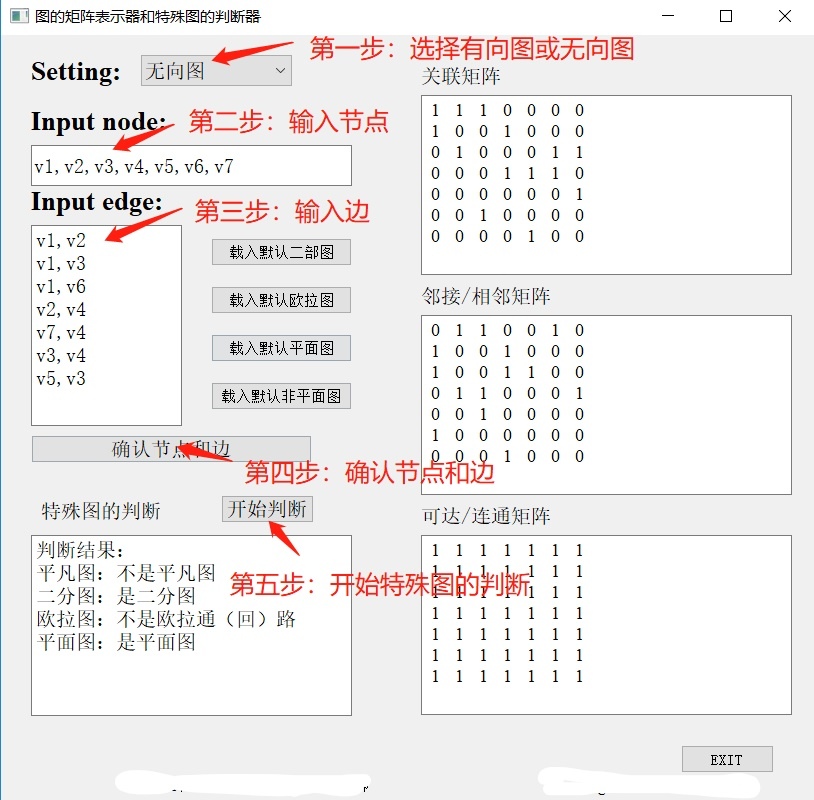

# graph-judger-and-matrix-representation-Discrete-Math
This is a discrete math project to judge special graph and give matrix representation of special graph. It's the class in Beihang University given by Prof. Zheng Zheng.  
图的矩阵表示和特殊图的判断，北航自动化学院一般专业课离散数学大作业。

## Requirement 
    Python 3.6  
    PyQt5

## Run
    python DMmyeric.py  
Then it comes out the GUI.  
The instructions are shown in the figure below.

## Functions
For matrix representation of special graph, I implement code to show:  
    
    incidence matrix for both directional and undirectional graph
    adjacency matrix for both directional and undirectional graph
    reacheable matrix for directional graph

  
For special graph judgement, I implement code to judge:  
    
    trivial graph 平凡图
    bipartite graph 二分图
    euler graph 欧拉回路\欧拉通路
    planer graph 平面图

